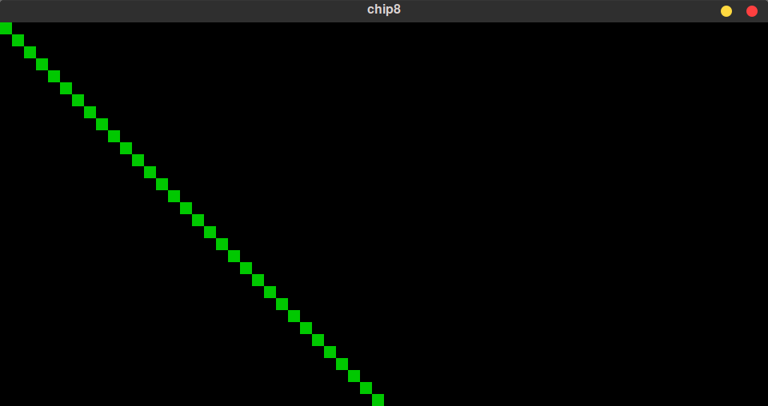
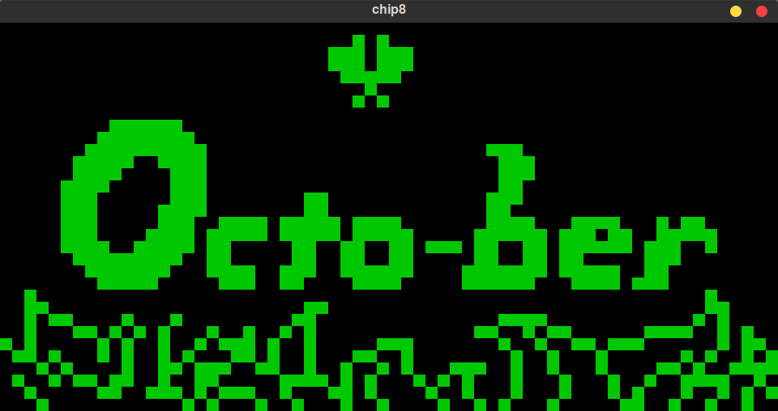

# [Support] エミュレータ開発体験記〜1970年代のシンプルな仮想マシンCHIP-8をRustで実装してみた〜 
  

こちらはコミックマーケット102（2023年夏） で「ぱおぞう工房」で販売した、CHIP-8の[Rust](https://www.rust-lang.org/)実装の同人誌 **エミュレータ開発体験記** のサポートページです。  


# ★[1] CHIP-8とは
**CHIP-8** は、今から数十年前の1970年代の初期のマイクロコンピュータ研究者であったJoseph Weisbecker氏が1802というマイコン向けに開発したもので、COSMAC VIPとTelmac 1800といった8bitコンピュータで使用されたものだそうです。実際にCHIP-8というコンピュータがあった訳ではなく、あくまでも一連のCHIP-8命令を実行するソフトウェアで一種のインタプリタ、簡単な命令シュミレータ、仮装マシン・・・です。

レトロ風味溢れるデモやゲームが公開されています。  


# ★[2] CHIP-8の実装サンプル
### SDL2(Simple DirectMedia Layer)が必要です
サンプルコードの実行には、[SDL2](https://www.libsdl.org/)のインストールが必要です。
#### (1) Windowsの場合
Windows の場合は[SDL2の公式ウェブサイト](https://www.libsdl.org/)に登録されている、SDL2のダイナミックリンクライブラリの下記2ファイルが必要です。
+ **SDL2.dll** 
+ **SDL2.lib**

「Download」の「SDL Release」をクリックして、「SDL2-develop-<バージョン>-VC.zip」をダウンロードして展開し、下記ファイルを cargo コマンドの実行ディレクトリに置いてから行って下さい。
#### (2) MacOSの場合
MacOSの場合は、[Homebrew](https://brew.sh/index_ja)のbrewコマンド等でSDL2をインストールして下さい。
```bash
> brew install sdl2 sdl2_gfx sdl2_image sdl2_mixer sdl2_sound sdl2_ttf
```

#### (3) Linux系、Rapsberry PIの場合
Linuxの場合は、各ディストリビューション付属のパッケージマネージャを使ってSDL2をインストールして下さい。  

例えば[Ubuntu](https://jp.ubuntu.com/) や [Rapsberry PI](https://www.raspberrypi.com/) の場合、aptコマンドを下記のように実行すれば良いと思います。
```bash 
> sudo apt -y install libsdl2-dev libsdl2-gfx-dev libsdl2-image-dev libsdl2-mixer-dev libsdl2-ttf-dev   libfreetype6 libfreetype6-dev
```
# ★[3] CHIP-8の実装サンプル
## [Exp.1) chip8rs001](./sample/chip8rs001/)

CHIP-8の64x32グラフィックの仮実装したものです。   
斜め線を表示します。  

CHIP-8命令コード等は実装していません。 

#### 実行方法  
gitコマンドで clone して、Rustのcargoコマンドで実行して下さい。
```
> git clone https://github.com/ORYZAPAO/chip8rsbook.git
> cd chip8rsbook/chip8rs001/
> cargo r danm8ku.ch8
```

## [ Exp.2) chip8rs002](./sample/chip8rs002/)

CHIP-8命令を実装しています（サウンドは実装していません）

実行時には、下記のようにCHIP-8のROMイメージファイル名を指定して下さい。  

#### 実行方法
gitコマンドで clone して、Rustのcargoコマンドで実行して下さい。
```
> git clone https://github.com/ORYZAPAO/chip8rsbook.git
> cd chip8rsbook/chip8rs001/
> cargo r octojam1title.ch8 <-- CHIP-8のROMイメージファイル名
```

# CHIP-8 ROMイメージファイルの入手先
以下に入手先を示します。

+ [CHIP-8 Archive](https://johnearnest.github.io/chip8Archive/)
+ [Welcome to David Winter's CHIP-8 emulation page !](http://pong-story.com/chip8/)

+ [Chip-8 Games Pack](https://www.zophar.net/pdroms/chip8/chip-8-games-pack.html)