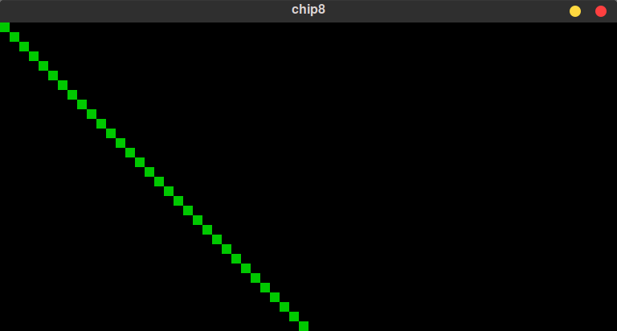

# **エミュレータ開発体験記〜1970年代のシンプルな仮想マシンCHIP-8をRustで実装してみた〜** 
こちらはコミックマーケット102 で販売した「 **エミュレータ開発体験記〜1970年代のシンプルな仮想マシンCHIP-8をRustで実装してみた〜** 」のサンプルコード置き場です。  


CHIP-8の[Rust](https://www.rust-lang.org/)実装です。

# CHIP-8とは
**CHIP-8** は、今から数十年前の1970年代の初期のマイクロコンピュータ研究者であったJoseph Weisbecker氏が1802というマイコン向けに開発したもので、COSMAC VIPとTelmac 1800といった8bitコンピュータで使用されたものだそうです。実際にCHIP-8というコンピュータがあった訳ではなく、あくまでも一連のCHIP-8命令を実行するソフトウェアで一種のインタプリタ、簡単な命令シュミレータ、仮装マシン・・・です。

レトロ風味溢れるデモやゲームが公開されています。  

# サンプルコード
## [chip8rs001](./chip8rs001/)
CHIP-8の64x32グラフィックの仮実装したものです。   
斜め線を表示します。  

CHIP-8命令コード等は実装していません。 


#### 実行方法  
gitコマンドで clone して、Rustのcargoコマンドで実行して下さい。
```
> git clone https://github.com/ORYZAPAO/chip8rsbook.git
> cd chip8rsbook/chip8rs001/
> cargo r danm8ku.ch8
```

## [chip8rs002](./chip8rs002/)
CHIP-8命令を実装しています（サウンドは実装していません）

実行時には、下記のようにCHIP-8のROMイメージファイル名を指定して下さい。  

#### 実行方法
gitコマンドで clone して、Rustのcargoコマンドで実行して下さい。
```
> git clone https://github.com/ORYZAPAO/chip8rsbook.git
> cd chip8rsbook/chip8rs001/
> cargo r octojam1title.ch8 <-- CHIP-8のROMイメージファイル名
```


# CHIP-8 ROMイメージファイルの入手先
以下に入手先を示します。

+ [CHIP-8 Archive](https://johnearnest.github.io/chip8Archive/)
+ [Welcome to David Winter's CHIP-8 emulation page !](http://pong-story.com/chip8/)

+ [Chip-8 Games Pack](https://www.zophar.net/pdroms/chip8/chip-8-games-pack.html)